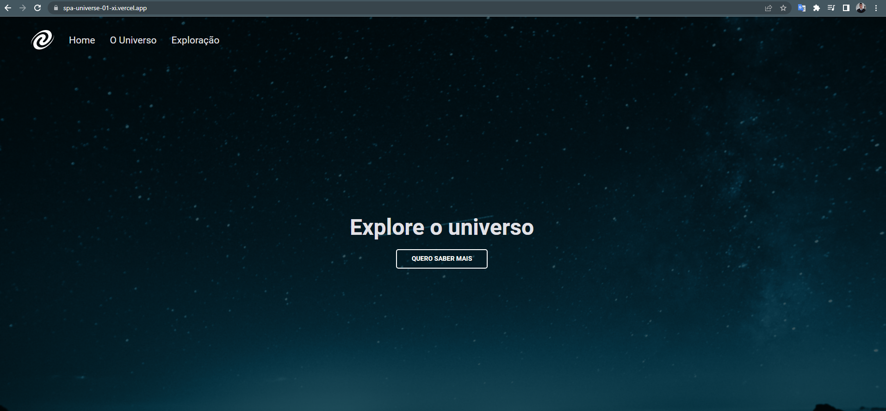

#  Desafio Stage 06 Javascript antes do framework

> Trilha Explorer 

Projeto construido do desafio 06 do programa Explorer da rocketseat 

👉🏼[Clique aqui para accessar](https://spa-universe-01-xi.vercel.app/)

##   💻🔧 Tecnologias

- Html 
- Css
- Git e Github
- Javascript
- SCSS
- nodeJS

## O que foi aplicado neste desafio

- Conceitos de SPA;
- Mapeamento de rotas;
- Assíncrono e promises;
- Orientação a objetos;
- Classes e muito mais. 
- Adicionando um servidor local e simples com NodeJS

## Contato 💻

juniorjose1925@gmail.com
